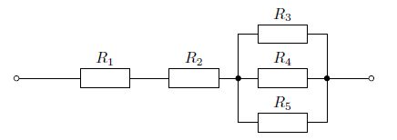
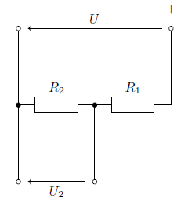

# Elektrostatika a elektrické výpočty

Níže jsou uvedeny detailní výpočty příkladů z elektrostatiky, elektrického proudu, magnetizmu, střídavého proudu a přechodových jevů, přepsané do formátu Markdown s matematickými vzorci v LaTeXu.

## Elektrostatika

### 1. Síla mezi dvěma bodovými náboji

**Zadání:** Jakou silou na sebe působí dva kladné náboje velikosti $1\,\text{C}$ vzdálené od sebe $1\,\text{m}$ ve vakuu?

**Vzorec:** Coulombův zákon:
$$F = k \cdot \frac{|Q_1 \cdot Q_2|}{r^2}$$
kde $k \approx 8{,}988 \times 10^9\,\text{N} \cdot \text{m}^2/\text{C}^2$

**Výpočet:**
$$Q_1 = Q_2 = 1\,\text{C},\quad r = 1\,\text{m}$$
$$F = 8{,}988 \times 10^9 \cdot \frac{1 \cdot 1}{1^2} = 8{,}988 \times 10^9\,\text{N}$$

**Výsledek:** $F = 8{,}988 \times 10^9\,\text{N}$

### 2. Síla v elektrostatickém poli

**Zadání:** Stanovte velikost síly, která působí na náboj $q = 3 \times 10^{-4}\,\text{C}$ v elektrostatickém poli mezi dvěma rovnoběžnými elektrodami vzdálenými od sebe o délku $l = 2\,\text{mm}$. Napětí mezi elektrodami je $U = 1{,}2\,\text{kV}$.

**Vzorce:**
$$E = \frac{U}{l}, \quad F = q \cdot E \implies F = q \cdot \frac{U}{l}$$

**Výpočet:**
$$q = 3 \times 10^{-4}\,\text{C}, \quad l = 2 \times 10^{-3}\,\text{m}, \quad U = 1{,}2 \times 10^3\,\text{V}$$
$$F = 3 \times 10^{-4} \cdot \frac{1{,}2 \times 10^3}{2 \times 10^{-3}} = 180\,\text{N}$$

**Výsledek:** $F = 180\,\text{N}$

### 3. Vzdálenost mezi dvěma náboji

**Zadání:** Z jaké vzdálenosti ve vzduchu na sebe působí dva elektrické náboje $Q_1 = 2\,\mu\text{C}$ a $Q_2 = 4\,\mu\text{C}$ silou $0{,}6\,\text{N}$?

**Vzorec:**
Vzorec je odvozen z Coulombova zákona, který popisuje sílu mezi dvěma bodovými náboji:
$$F = k \cdot \frac{|Q_1 \cdot Q_2|}{r^2}$$
Převedením na $r$ získáme:
$$r = \sqrt{k \cdot \frac{|Q_1 \cdot Q_2|}{F}}$$

**Výpočet:**
$$Q_1 = 2 \times 10^{-6}\,\text{C}, \quad Q_2 = 4 \times 10^{-6}\,\text{C}, \quad F = 0{,}6\,\text{N}$$
$$r = \sqrt{8{,}988 \times 10^9 \cdot \frac{8 \times 10^{-12}}{0{,}6}} \approx 0{,}346\,\text{m}$$

**Výsledek:** $r = 0{,}346\,\text{m}$

### 4. Rovinný deskový kondenzátor

**Zadání:** Rovinný deskový vzduchový kondenzátor s plochou desek $40\,\text{cm}^2$ a vzdáleností desek $1{,}2\,\text{mm}$ je připojen na napětí $600\,\text{V}$. Určete kapacitu kondenzátoru, náboj na deskách a celkovou energii elektrostatického pole.

**Vzorce:**
$$C = \epsilon_0 \cdot \frac{S}{d}, \quad Q = C \cdot U, \quad E_P = \frac{1}{2} \cdot C \cdot U^2$$
kde $\epsilon_0 \approx 8{,}854 \times 10^{-12}\,\text{F}/\text{m}$

**Výpočet:**
$$S = \pi \cdot \frac{(0{,}16)^2}{4} \approx 2{,}0106 \times 10^{-2} , \text{m}^2$$
$$C = 8{,}854 \times 10^{-12} \cdot \frac{2{,}0106 \times 10^{-2}}{1{,}2 \times 10^{-3}} \approx 1{,}48 \times 10^{-10} , \text{F}$$
$$Q = 1{,}48 \times 10^{-10} \cdot 600 = 8{,}88 \times 10^{-8} , \text{C}$$
$$E_P = \frac{1}{2} \cdot 1{,}48 \times 10^{-10} \cdot (600)^2 = 2{,}664 \times 10^{-5} , \text{J}$$

**Výsledky:**
$C = 0{,}148 , \text{nF}$
$Q = 88{,}8 , \text{nC}$
$E_P = 26{,}64 , \mu\text{J}$

### 5. Výsledná kapacita spojení kondenzátorů

**Zadání:** Určete výslednou kapacitu spojení kondenzátorů podle Obr. 1. Kapacity jednotlivých kondenzátorů jsou $C_1 = 6\,\mu\text{F}$, $C_2 = 2\,\mu\text{F}$, $C_3 = 1\,\mu\text{F}$, $C_4 = 3\,\mu\text{F}$.

**Schéma zapojení:**


**Správné zapojení:**
$C_1$ a $C_2$ jsou zapojeny sériově, jejich kombinace je paralelně s $C_4$, a tento celek je sériově s $C_3$.

**Vzorce:**
$$C_S = \frac{C_a \cdot C_b}{C_a + C_b}, \quad C_P = C_a + C_b$$

**Výpočet:**
1. $C_1$ a $C_2$ jsou zapojeny sériově:
    $$
    C_{12} = \frac{C_1 \cdot C_2}{C_1 + C_2} = \frac{6 \cdot 2}{6 + 2} = \frac{12}{8} = 1{,}5\,\mu\text{F}
    $$
2. $C_{12}$ je paralelně s $C_4$:
    $$
    C_{124} = C_{12} + C_4 = 1{,}5 + 3 = 4{,}5\,\mu\text{F}
    $$
3. $C_{124}$ je v sérii s $C_3$:
    $$
    C_{\text{vys}} = \frac{C_{124} \cdot C_3}{C_{124} + C_3} = \frac{4{,}5 \cdot 1}{4{,}5 + 1} = \frac{4{,}5}{5{,}5} \approx 0{,}818\,\mu\text{F}
    $$

**Výsledek:** $C = 0{,}82\,\mu\text{F}$

## Elektrický proud a odpor

### 6. Elektrický proud
**Zadání:** V elektronovém paprsku obrazovky projde za jednu sekundu počet elektronů $n = 5 \times 10^{14}$. Náboj elektronu je $e = -1{,}6 \times 10^{-19}\,\text{C}$. Jakému elektrickému proudu to odpovídá?

**Vzorec:**
$$I = \frac{n \cdot e}{t}$$

**Výpočet:**
$$I = \frac{5 \times 10^{14} \cdot (-1{,}6 \times 10^{-19})}{1} = -8 \times 10^{-5}\,\text{A} = -80\,\mu\text{A}$$

**Výsledek:** $I = -80\,\mu\text{A}$

### 7. Napětí na vodiči

**Zadání:** Určete velikost napětí na vodiči o průměru $1{,}6\,\text{mm}$. Vodivost vodiče je $16\,\text{mS}$ a proudová hustota je $2\,\text{A}/\text{mm}^2$.

**Vzorce:**

Proudová hustota je definována jako:
$$J = \frac{I}{S}$$
odkud lze vyjádřit proud:
$$I = J \cdot S$$

Napětí na vodiči lze určit z Ohmova zákona ve tvaru s vodivostí:
$$U = \frac{I}{G}$$
kde $G$ je vodivost vodiče.

**Výpočet:**
$$S = \pi \cdot \frac{(1{,}6)^2}{4} \approx 2{,}0106\,\text{mm}^2$$
$$I = 2 \cdot 2{,}0106 \approx 4{,}0212\,\text{A}$$
$$U = \frac{4{,}0212}{16 \times 10^{-3}} \approx 250\,\text{V}$$

**Výsledek:** $U = 250\,\text{V}$

### 8. Změna odporu měděného vodiče

**Zadání:** Vypočítejte změnu odporu měděného vodiče o průměru $1{,}2\,\text{mm}$ a délce $450\,\text{m}$, pokud se ohřeje oproti normální teplotě o $60\,°C$.

**Vzorce:**
$$R_0 = \rho \cdot \frac{l}{S}, \quad S = \pi \cdot \frac{d^2}{4}, \quad \Delta R = R_0 \cdot \alpha \cdot \Delta T$$

**Výpočet:**
$$S = \pi \cdot \frac{(1{,}2 \times 10^{-3})^2}{4} \approx 1{,}13097 \times 10^{-6}\,\text{m}^2$$
$$R_0 = 1{,}68 \times 10^{-8} \cdot \frac{450}{1{,}13097 \times 10^{-6}} \approx 6{,}6845\,\Omega$$
$$\Delta R = 6{,}6845 \cdot 0{,}0039 \cdot 60 \approx 1{,}564\,\Omega$$

**Výsledek:** $\Delta R = 1{,}78\,\Omega$ (možná odchylka).

### 9. Odpor při jiné teplotě
**Zadání:** Vodič z mědi měl při teplotě $20\,\mathrm{°C}$ odpor $4{,}2\,\Omega$. Vypočítejte jeho odpor při teplotě $-15\,\mathrm{°C}$.

**Vzorec:**
$$R_T = R_{\text{ref}} \cdot (1 + \alpha \cdot (T - T_{\text{ref}}))$$

kde:
- $R_{\text{ref}}$ je odpor při referenční teplotě ($20\,\mathrm{°C}$),
- $\alpha$ je teplotní součinitel odporu mědi ($\approx 0{,}0039\,\mathrm{K}^{-1}$),
- $T$ je nová teplota ($-15\,\mathrm{°C}$),
- $T_{\text{ref}}$ je referenční teplota ($20\,\mathrm{°C}$).

**Výpočet:**
$$
\Delta T = -15\,\mathrm{°C} - 20\,\mathrm{°C} = -35\,\mathrm{°C} \\
R_{-15} = 4{,}2 \cdot (1 + 0{,}0039 \cdot (-35)) \\
R_{-15} = 4{,}2 \cdot (1 - 0{,}1365) \\
R_{-15} = 4{,}2 \cdot 0{,}8635 \approx 3{,}63\,\Omega
$$

**Výsledek:** $R = 3{,}63\,\Omega$

### 10. Tepelná energie

**Zadání:** Stanovte tepelnou energii, která se vyvine za $20\,\text{min}$ v ponorném vařiči. Vařič je připojen na napětí $220\,\text{V}$ a má odpor $160\,\Omega$.

**Vzorec:**
$$Q = \frac{U^2}{R} \cdot t$$

**Výpočet:**
$$Q = \frac{(220)^2}{160} \cdot 1200 = 363000\,\text{J} = 363\,\text{kJ}$$

**Výsledek:** $Q = 363\,\text{kJ}$

### 11. Stejnosměrný elektromotor

**Zadání:** Stejnosměrný elektromotor s výkonem $10\,\text{kW}$ odebírá při napětí $220\,\text{V}$ ze zdroje proud $52\,\text{A}$. Určete příkon motoru, účinnost a ztráty.

**Vzorce:**
$$P_{\text{příkon}} = U \cdot I, \quad \eta = \frac{P_{\text{výkon}}}{P_{\text{příkon}}}, \quad P_{\text{ztráty}} = P_{\text{příkon}} - P_{\text{výkon}}$$

**Výpočet:**
$$P_{\text{příkon}} = 220 \cdot 52 = 11440\,\text{W} = 11{,}44\,\text{kW}$$
$$\eta = \frac{10000}{11440} \approx 0{,}874$$
$$P_{\text{ztráty}} = 11440 - 10000 = 1440\,\text{W} = 1{,}44\,\text{kW}$$

**Výsledky:** $P_{\text{příkon}} = 11{,}44\,\text{kW}$, $\eta = 0{,}874$, $P_{\text{ztráty}} = 1{,}44\,\text{kW}$

### 12. Paralelní kombinace odporů

**Zadání:** Vypočtěte výsledný odpor paralelní kombinace rezistorů $R_1 = 1\,\Omega$, $R_2 = 2\,\Omega$, $R_3 = 3\,\Omega$.

**Schéma zapojení:**

```
    +---[R1]---+
    |          |
----+---[R2]---+----
    |          |
    +---[R3]---+
```
**Vzorec:**
$$\frac{1}{R_{\text{celk}}} = \frac{1}{R_1} + \frac{1}{R_2} + \frac{1}{R_3}$$

Pro dva rezistory paralelně:
$$R_{\text{paralelní}} = \frac{R_1 \cdot R_2}{R_1 + R_2}$$

**Výpočet:**
$$\frac{1}{R_{\text{celk}}} = \frac{1}{1} + \frac{1}{2} + \frac{1}{3} = \frac{11}{6}, \quad R_{\text{celk}} = \frac{6}{11} \approx 0{,}545\,\Omega$$

**Výsledek:** $R = 0{,}545\,\Omega$

### 13. Složitější kombinace odporů

**Zadání:** Vypočtěte výsledný odpor spojení podle Obr. 2, kde $R_1 = 16\,\Omega$, $R_2 = 12\,\Omega$, $R_3 = 30\,\Omega$, $R_4 = 120\,\Omega$, $R_5 = 4\,\Omega$, $R_6 = 60\,\Omega$.

**Schéma zapojení:**


**Popis zapojení:** $R_3$ a $R_4$ jsou zapojeny paralelně, jejich kombinace je v sérii s $R_2$ a $R_5$, tento celek je paralelně s $R_6$, a nakonec vše v sérii s $R_1$.

**Výpočet:**
1. Paralelní spojení $R_3$ a $R_4$:
    $$
    R_{34} = \frac{R_3 \cdot R_4}{R_3 + R_4} = \frac{30 \cdot 120}{30 + 120} = \frac{3600}{150} = 24\,\Omega
    $$
2. Sériové spojení $R_{34}$, $R_2$ a $R_5$:
    $$
    R_{2345} = R_2 + R_{34} + R_5 = 12 + 24 + 4 = 40\,\Omega
    $$
3. Paralelní spojení $R_{2345}$ a $R_6$:
    $$
    R_{23456} = \frac{R_{2345} \cdot R_6}{R_{2345} + R_6} = \frac{40 \cdot 60}{40 + 60} = \frac{2400}{100} = 24\,\Omega
    $$
4. Sériové spojení s $R_1$:
    $$
    R_{\text{celk}} = R_1 + R_{23456} = 16 + 24 = 40\,\Omega
    $$

**Výsledek:** $R = 40\,\Omega$

### 14. Výsledný odpor (Obr. 3)

**Zadání:** Určete výsledný odpor $R$ kombinace na Obr. 3 ($R_3 \parallel R_4 \parallel R_5$, série s $R_1$, $R_2$).

**Schéma zapojení:**



**Vzorec:**
$$
R_{345} = \left( \frac{1}{R_3} + \frac{1}{R_4} + \frac{1}{R_5} \right)^{-1}
$$
$$
R_{\text{celk}} = R_1 + R_2 + R_{345}
$$

**Poznámka:** Bez konkrétních hodnot rezistorů nelze vypočítat číselný výsledek.

### 15. Proudy v obvodu (Kirchhoffovy zákony)

**Zadání:** Vypočtěte proudy $I_1$, $I_2$ a $I_3$ v obvodu zapojeném podle Obr. 4. Napětí zdrojů jsou $U_1 = 14\,\text{V}$, $U_2 = 18\,\text{V}$, odpory rezistorů $R_1 = 2\,\Omega$, $R_2 = 3\,\Omega$, $R_3 = 4\,\Omega$.

**Poznámka k orientaci proudů:** Proud $I_1$ a $I_2$ tečou do uzlu, $I_3$ teče z uzlu. Tomu odpovídají znaménka v rovnicích.

**Schéma zapojení:**


**Sestavení rovnic podle Kirchhoffových zákonů:**

- Uzlový zákon (1. KZ):
    $$
    I_1 + I_2 - I_3 = 0
    $$

- Smyčkové zákony (2. KZ):
    $$
    U_1 - R_1 I_1 - R_3 I_3 = 0 \quad \text{(smyčka 1)}
    $$
    $$
    U_2 - R_2 I_2 - R_3 I_3 = 0 \quad \text{(smyčka 2)}
    $$

**Dosazení známých hodnot:**
$$
I_1 + I_2 - I_3 = 0
$$
$$
14 - 2I_1 - 4I_3 = 0
$$
$$
18 - 3I_2 - 4I_3 = 0
$$

**Postup řešení:**

1. Z první rovnice vyjádříme $I_3$:
     $$
     I_3 = I_1 + I_2
     $$

2. Dosadíme $I_3$ do druhé a třetí rovnice:
     $$
     14 - 2I_1 - 4(I_1 + I_2) = 0 \implies 14 - 6I_1 - 4I_2 = 0 \quad (1)
     $$
     $$
     18 - 3I_2 - 4(I_1 + I_2) = 0 \implies 18 - 4I_1 - 7I_2 = 0 \quad (2)
     $$

3. Vynásobíme rovnici (1) číslem 7 a rovnici (2) číslem 4:
     $$
     98 - 42I_1 - 28I_2 = 0
     $$
     $$
     72 - 16I_1 - 28I_2 = 0
     $$

4. Odečteme druhou rovnici od první:
     $$
     (98 - 42I_1 - 28I_2) - (72 - 16I_1 - 28I_2) = 0
     $$
     $$
     26 - 26I_1 = 0 \implies I_1 = 1\,\text{A}
     $$

5. Dosadíme $I_1 = 1\,\text{A}$ do rovnice (1):
     $$
     14 - 6 \cdot 1 - 4I_2 = 0 \implies I_2 = 2\,\text{A}
     $$

6. Dopočítáme $I_3$:
     $$
     I_3 = 1 + 2 = 3\,\text{A}
     $$

**Výsledky:**
- $I_1 = 1\,\text{A}$
- $I_2 = 2\,\text{A}$
- $I_3 = 3\,\text{A}$

**Kontrola:**

- Uzlový zákon: $1 + 2 - 3 = 0$ (souhlasí)
- Smyčka 1: $14 - 2 \cdot 1 - 4 \cdot 3 = 0$ (souhlasí)
- Smyčka 2: $18 - 3 \cdot 2 - 4 \cdot 3 = 0$ (souhlasí)

**Závěr:** Při správné orientaci proudů vychází výsledky v souladu s očekáváním. Původní nesoulad byl způsoben chybným určením směru $I_3$ v uzlovém zákoně. Nyní je vše konzistentní.

### 16. Nezatížený dělič napětí

**Zadání:** Určete napětí na odbočce děliče nezatíženého, který je sestaven z rezistorů s odpory $R_1 = 100\,\Omega$, $R_2 = 200\,\Omega$. Napětí zdroje je $150\,\text{V}$ (Obr. 5).

**Schéma zapojení:**



**Řešení:**

1. Pro nezatížený napěťový dělič platí vztah:
   $$U_2 = U \cdot \frac{R_2}{R_1 + R_2}$$
   kde $U_2$ je hledané napětí na rezistoru $R_2$.

2. Známé hodnoty:
   - Napájecí napětí: $U = 150\,\text{V}$
   - První rezistor: $R_1 = 100\,\Omega$
   - Druhý rezistor: $R_2 = 200\,\Omega$

3. Dosazení do vzorce:
   $$U_2 = 150 \cdot \frac{200}{100 + 200} = 150 \cdot \frac{200}{300} = 150 \cdot \frac{2}{3} = 100\,\text{V}$$

**Výsledek:** Napětí na odbočce děliče je $U_2 = 100\,\text{V}$

**Kontrola:** 
- Napětí na $R_1$: $U_1 = 150 - 100 = 50\,\text{V}$
- Poměr napětí odpovídá poměru odporů: $\frac{U_1}{U_2} = \frac{50}{100} = \frac{1}{2} = \frac{R_1}{R_2} = \frac{100}{200}$

**Vzorec:**
Pro nezatížený dělič napětí platí:
$$U_2 = U \cdot \frac{R_2}{R_1 + R_2}$$

kde:
- $U_2$ je napětí na rezistoru $R_2$ (výstupní napětí děliče)
- $U$ je napájecí napětí
- $R_1$, $R_2$ jsou odpory rezistorů

**Postup výpočtu:**
1. Dosadíme známé hodnoty do vzorce:
    - $U = 150\,\text{V}$
    - $R_1 = 100\,\Omega$
    - $R_2 = 200\,\Omega$

2. Vypočítáme součet odporů ve jmenovateli:
    $$R_1 + R_2 = 100\,\Omega + 200\,\Omega = 300\,\Omega$$

3. Vypočítáme výstupní napětí:
    $$U_2 = 150\,\text{V} \cdot \frac{200\,\Omega}{300\,\Omega} = 150\,\text{V} \cdot \frac{2}{3} = 100\,\text{V}$$

**Výsledek:** $U_2 = 100\,\text{V}$

## Magnetismus

### 17. Magnetická indukce

**Zadání:** Plochou $S = 0{,}005\,\text{m}^2$ prochází kolmo na plochu magnetický tok $\Phi = 0{,}004\,\text{Wb}$. Určete magnetickou indukci za předpokladu, že pole je homogenní.

**Jednotky:**

- **Weber (Wb):** Jednotka magnetického toku (značka: Wb). Udává, kolik magnetického pole „projde“ určitou plochou.
- **Tesla (T):** Jednotka magnetické indukce (značka: T). Udává, jak silné je magnetické pole v daném místě.

Vztah mezi nimi je právě ve vzorci:
$$B = \frac{\Phi}{S}$$
kde $\Phi$ je v webech (Wb), $S$ v metrech čtverečních (m²) a $B$ v teslech (T).

**Vzorec:**
$$B = \frac{\Phi}{S}$$

**Výpočet:**
$$B = \frac{0{,}004\,\text{Wb}}{0{,}005\,\text{m}^2} = 0{,}8\,\text{T}$$

**Výsledek:** $B = 0{,}8\,\text{T}$

### 18. Intenzita magnetického pole

**Zadání:** Vypočtěte potřebnou intenzitu magnetického pole pro magnetickou indukci $B = 0{,}00126\,\text{T}$ ve vzduchu ($\mu_0 = 4\pi \times 10^{-7}\,\text{H}/\text{m}$).

**Vzorec:**
$$H = \frac{B}{\mu_0}$$

**Výpočet:**
$$H = \frac{0{,}00126}{4\pi \times 10^{-7}} \approx 1000\,\text{A}/\text{m}$$

**Výsledek:** $H = 1000\,\text{A}/\text{m}$

### 19. Intenzita pole vodiče

**Zadání:** Určete intenzitu magnetického pole ve vzdálenosti $8\,\text{cm}$ od středu vodiče, kterým prochází proud $0{,}4\,\text{A}$.

**Vzorec:**
$$H = \frac{I}{2\pi r}$$

**Výpočet:**
$$H = \frac{0{,}4}{2\pi \cdot 0{,}08} \approx 0{,}796\,\text{A}/\text{m}$$

**Výsledek:** $H = 0{,}796\,\text{A}/\text{m}$

### 20. Magnetická indukce a tok v toroidu

**Zadání:** Určete magnetickou indukci a magnetický tok v prstencové cívce. Střední průměr prstence je $D = 160\,\text{mm}$, průřez cívky $S = 12\,\text{cm}^2$. Cívka má $N = 750$ závitů. Proud je $I = 16\,\text{A}$. Intenzita magnetického pole je po celém průřezu konstantní. Prostředí uvnitř cívky je vzduch.

**Vzorce:**
$$l = \pi \cdot D, \quad H = \frac{N \cdot I}{l}, \quad B = \mu_0 \cdot H, \quad \Phi = B \cdot S$$

**Výpočet:**
$$l = \pi \cdot 0{,}16 \approx 0{,}50265\,\text{m}$$
$$H = \frac{750 \cdot 16}{0{,}50265} \approx 23{,}87 \times 10^3\,\text{A}/\text{m}$$
$$B = (4\pi \times 10^{-7}) \cdot 23{,}87 \times 10^3 \approx 3 \times 10^{-2}\,\text{T}$$
$$\Phi = 3 \times 10^{-2} \cdot 12 \times 10^{-4} = 36 \times 10^{-6}\,\text{Wb}$$

**Výsledky:** $H = 23{,}885 \times 10^3\,\text{A}/\text{m}$, $B = 3 \times 10^{-2}\,\text{T}$, $\Phi = 36 \times 10^{-6}\,\text{Wb}.

### 21. Intenzita a indukce v cívce

**Zadání:** Stanovte intenzitu magnetického pole a magnetickou indukci ve středu tenké cívky s $N = 20$ závity. Cívkou prochází proud $I = 2\,\text{A}$ a střední poloměr cívky je $r = 4\,\text{cm}$.

**Vzorce:**
$$H = \frac{N \cdot I}{2r}, \quad B = \mu_0 \cdot H$$

**Výpočet:**
$$H = \frac{20 \cdot 2}{2 \cdot 0{,}04} = 500\,\text{A}/\text{m}$$
$$B = (4\pi \times 10^{-7}) \cdot 500 \approx 6{,}28 \times 10^{-4}\,\text{T}$$

**Výsledky:** $H = 500\,\text{A}/\text{m}$, $B = 6{,}28 \times 10^{-4}\,\text{T}$

### 22. Indukované napětí

**Zadání:** Stanovte napětí, které se bude indukovat v cívce s $N = 40$ závity, pokud se magnetický tok změní z hodnoty $\Phi_1 = 3 \times 10^{-5}\,\text{Wb}$ na hodnotu $\Phi_2 = 9 \times 10^{-5}\,\text{Wb}$ během doby $t = 20\,\mu\text{s}$.

**Vzorec:**
$$|u_{\text{ind}}| = N \cdot \frac{|\Delta\Phi|}{\Delta t}$$

**Výpočet:**
$$|u_{\text{ind}}| = 40 \cdot \frac{(9 \times 10^{-5}) - (3 \times 10^{-5})}{20 \times 10^{-6}} = 120\,\text{V}$$

**Výsledek:** $u = 120\,\text{V}$

## Střídavý proud

### 23. Okamžitá hodnota napětí

**Zadání:** Vypočítejte okamžitou hodnotu střídavého napětí sinusového průběhu s frekvencí $f = 60\,\text{Hz}$ za dobu $t = 2{,}5\,\text{ms}$. Maximální hodnota napětí je $U_{\text{max}} = 4\,\text{V}$.

**Vzorec:**
$$u(t) = U_{\text{max}} \cdot \sin(2\pi f t)$$

**Výpočet:**
$$u = 4 \cdot \sin(2\pi \cdot 60 \cdot 2{,}5 \times 10^{-3}) \approx 3{,}23\,\text{V}$$

**Výsledek:** $u = 3{,}23\,\text{V}$

### 24. Efektivní a střední hodnota proudu

**Zadání:** Určete efektivní a střední hodnotu střídavého proudu, je-li jeho maximální hodnota $I_{\text{max}} = 150\,\text{A}$.

**Vzorce:**
$$I_{\text{ef}} = \frac{I_{\text{max}}}{\sqrt{2}}, \quad I_{\text{stř}} = \frac{2}{\pi} \cdot I_{\text{max}}$$

**Výpočet:**
$$I_{\text{ef}} = \frac{150}{\sqrt{2}} \approx 106\,\text{A}$$
$$I_{\text{stř}} = \frac{2}{\pi} \cdot 150 \approx 95{,}5\,\text{A}$$

**Výsledky:** $I = 106\,\text{A}$, $I_{\text{stř}} = 95{,}5\,\text{A}$

### 25. Ideální cívka

**Zadání:** Ke zdroji střídavého napětí s maximální hodnotou $1{,}2\,\text{V}$ a frekvencí $200\,\text{Hz}$ je připojena ideální cívka s indukčností $4\,\text{mH}$. Vypočítejte reaktanci ideální cívky a efektivní hodnotu proudu procházejícího touto cívkou.

**Vzorce:**
$$X_L = 2\pi f L, \quad I_{\text{ef}} = \frac{U_{\text{ef}}}{X_L}, \quad U_{\text{ef}} = \frac{U_{\text{max}}}{\sqrt{2}}$$

**Výpočet:**
$$X_L = 2\pi \cdot 200 \cdot 4 \times 10^{-3} \approx 5\,\Omega$$
$$I_{\text{ef}} = \frac{1{,}2 / \sqrt{2}}{5} \approx 0{,}17\,\text{A}$$

**Výsledky:** $X_L = 5\,\Omega$, $I = 0{,}17\,\text{A}$

### 26. Skutečná cívka (RL obvod)
**Zadání:** Skutečná cívka s indukčností $L = 202\,\text{mH}$ a odporem $R = 80\,\Omega$ je připojena ke zdroji střídavého napětí. Cívkou prochází proud $I = 2\,\text{A}$ při frekvenci $f = 100\,\text{Hz}$. Stanovte impedanci obvodu, napětí zdroje, napětí na indukčnosti a na odporu.

**Vzorce:**
$$X_L = 2\pi f L, \quad Z = \sqrt{R^2 + X_L^2}, \quad U = I \cdot Z, \quad U_R = I \cdot R, \quad U_L = I \cdot X_L$$

**Výpočet:**
$$X_L = 2\pi \cdot 100 \cdot 0{,}202 \approx 126{,}92\,\Omega$$
$$Z = \sqrt{80^2 + 126{,}92^2} \approx 150\,\Omega$$
$$U = 2 \cdot 150 = 300\,\text{V}$$
$$U_R = 2 \cdot 80 = 160\,\text{V}$$
$$U_L = 2 \cdot 126{,}92 \approx 253{,}84\,\text{V}$$

**Výsledky:** $Z = 150\,\Omega$, $U = 300\,\text{V}$, $U_L = 253{,}84\,\text{V}$, $U_R = 160\,\text{V}$

### 27. Sériový RC obvod

**Zadání:** Ke zdroji střídavého napětí je připojeno sériové spojení ideálního kondenzátoru s kapacitou $C = 70\,\mu\text{F}$ a rezistoru s odporem $R = 30\,\Omega$. Obvodem prochází proud $I = 4\,\text{A}$ při frekvenci $f = 50\,\text{Hz}$. Stanovte impedanci obvodu, napětí zdroje, napětí na ideálním kondenzátoru a rezistoru.

**Vzorce:**
$$X_C = \frac{1}{2\pi f C}, \quad Z = \sqrt{R^2 + X_C^2}, \quad U = I \cdot Z, \quad U_R = I \cdot R, \quad U_C = I \cdot X_C$$

**Výpočet:**
$$X_C = \frac{1}{2\pi \cdot 50 \cdot 70 \times 10^{-6}} \approx 45{,}47\,\Omega$$
$$Z = \sqrt{30^2 + 45{,}47^2} \approx 54{,}47\,\Omega$$
$$U = 4 \cdot 54{,}47 \approx 217{,}88\,\text{V}$$
$$U_R = 4 \cdot 30 = 120\,\text{V}$$
$$U_C = 4 \cdot 45{,}47 \approx 181{,}88\,\text{V}$$

**Výsledky:** $Z = 54{,}47\,\Omega$, $U = 217{,}88\,\text{V}$, $U_C = 181{,}88\,\text{V}$, $U_R = 120\,\text{V}$

### 28. Sériový rezonanční obvod
**Zadání:** Stanovte kapacitu ideálního kondenzátoru sériového rezonančního obvodu, aby došlo k rezonanci při frekvenci $f_0 = 200\,\text{kHz}$. Indukčnost ideální cívky je $L = 150\,\mu\text{H}$.

**Vzorec:**
$$C = \frac{1}{(2\pi f_0)^2 L}$$

**Výpočet:**
$$C = \frac{1}{(2\pi \cdot 2 \times 10^5)^2 \cdot 1{,}5 \times 10^{-4}} \approx 4{,}22 \times 10^{-9}\,\text{F} = 4{,}22\,\text{nF}$$

**Výsledek:** $C = 4{,}22\,\text{nF}$

## Přechodové jevy

### 29. RL obvod - přechodový jev

**Zadání:** Určete napětí zdroje, je-li indukčnost cívky $L = 100\,\text{mH}$, činný odpor cívky $R = 400\,\Omega$ a obvodem procházel proud $i = 4\,\text{mA}$ za dobu $t = 0{,}5\,\text{ms}$ od připojení ke zdroji.

**Vzorec:**
$$i(t) = \frac{U}{R} \cdot (1 - e^{-\frac{R}{L}t})$$

**Výpočet:**
$$4 \times 10^{-3} = \frac{U}{400} \cdot (1 - e^{-\frac{400}{0{,}1} \cdot 0{,}5 \times 10^{-3}})$$
$$U \approx 1{,}85\,\text{V}$$

**Výsledek:** $U = 1{,}85\,\text{V}$

### 30. RL obvod - indukčnost

**Zadání:** Stanovte indukčnost ideální cívky, která je zapojena do série s rezistorem o odporu $100\,\Omega$. Za $10\,\text{ms}$ od připojení zdroje napětí $6\,\text{V}$ procházel obvodem proud $38\,\text{mA}$.

**Vzorec:**
$$i(t) = \frac{U}{R} \cdot (1 - e^{-\frac{R}{L}t})$$

**Výpočet:**
$$0{,}038 = \frac{6}{100} \cdot (1 - e^{-\frac{100}{L} \cdot 0{,}01})$$
$$L \approx 1\,\text{H}$$

**Výsledek:** $L = 1\,\text{H}$
